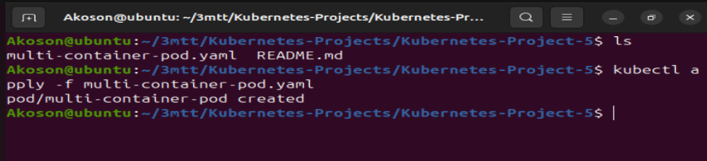

# Networking in Kubernetes

### Networking refers to the mechanisms and configurations that allow communication between different components (pods, services, and other resources) within a Kubernetes cluster. Kubernetes provides a flexible and powerful networking model to enable seamless interaction between containers and services, whether they are running on the same node or across different nodes in a cluster.

## Some key aspects of networking in Kubernetes

**Pod Networking**
### Containers within a pod share the same network namespace, allowing them to communicate with each other using localhost. This enables tight coupling between containers within the same pod.

**Service Networking**
### Kubernetes Services provide a way to expose a group of pods as a single, stable network endpoint. Services have an associated Cluster IP that allows other pods to communicate with the service. Services can be exposed internally within the cluster or externally to the outside world.

**Pod-to-Pod Communication**
### Pods communicate with each other using their individual IP addresses. Kubernetes ensures that pods can reach each other directly, regardless of the node they are running on, by using an overlay network.

**Ingress**
### Ingress is a Kubernetes resource that allows external access to services within the cluster. It defines rules for routing external HTTP and HTTPS traffic to different services based on the host or path. Ingress controllers manage the actual routing and traffic flow.

**Network Policies**
### Kubernetes Network Policies define rules for controlling the communication between pods. These policies allow administrators to specify how pods can communicate with each other, enhancing security within the cluster.

**Container Network Interface (CNI)**
### Kubernetes relies on Container Network Interface (CNI) to implement networking solutions. CNIs provide a standardized interface for networking plugins to integrate with Kubernetes, allowing for flexibility and choice in networking implementations.

### Let’s get our hands on pod networking in Kubernetes by deploying a pod with multiple containers, showcasing how they share the same network namespace and can communicate with each other using localhost. 

## Here’s a step-by-step guide using Kubernetes and kubectl:


## Project Directory


### 1. Creating a Multi-Container Pod YAML file (e.g., multi-container-pod.yaml) and pasting the multi-container-pod.yaml file

```
apiVersion: v1
kind: Pod
metadata:
  name: multi-container-pod
spec:
  containers:
  - name: container-1
    image: nginx:alpine
  - name: container-2
    image: busybox
    command:
      - '/bin/sh'
      - '-c'
      - 'mkdir -p /usr/share/nginx/html && while true; do echo "Hello from Container 2" >> /usr/share/nginx/html/index.html; sleep 10; done'

```

## Explanation of the yaml snippet above

### apiVersion: v1: Specifies the Kubernetes API version for the object being created, in this case, a Pod.

### kind: Pod: Defines the type of Kubernetes resource being created, which is a Pod. Pods are the smallest deployable units in Kubernetes and can host one or more containers.

### metadata: Contains metadata for the Pod, including the name of the Pod, which is set to “multi-container-pod”.

### spec: Describes the desired state of the Pod.

### containers: Specifies the containers configuration for the Pod.

### name: container-1: Defines the first container in the Pod with the name “container-1” and uses the nginx:alpine image.

### name: container-2: Defines the second container in the Pod with the name “container-2” and uses the busybox image. Additionally, it specifies a command to create an HTML file in the Nginx directory and continuously appends “Hello from Container 2” to it every 10 seconds.

### The pod has two containers – one running the Nginx web server and another running BusyBox with a script to continuously append “Hello from Container 2” to the Nginx default HTML file.


### 2. Applying the pod configuration




## 3. Checking pod status and logs

### i. Checking status


### ii. Checking container-1 and 2 logs


### Careful observation shows that both containers are running with the same pod, and they share the same network nameplate. The nginx container serves the default page, and the Busybox container continer continously update the HTML file.


## Accessing Nginx from BusyBox Container


### This command log you inside the container. Within the BusyBox container. 

### Then use the command `wget -qO- http://localhost` to access the Nginx page.


### This demostrate how containers within the same pod can communicate with each other using `localhost`

## Summary:
### container-1 (Nginx) started correctly, served web traffic, and handled requests sent from container-2 using localhost.

### The pod’s networking is working as expected — both containers share the same network namespace, which is why localhost connects them.